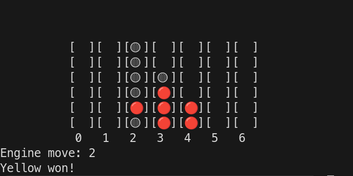

# FourFish: A Connect 4 Engine

A toy single-threaded connect 4 minimax engine written from scratch.



## Features

- TUI
- Customizable board size

## Implementation

- Minimax
- Bitboard implementation (~30 mio. nodes/s)
- Alpha-beta pruning
- Simple heuristic
- CMake build system
- Zero dependencies
- Human-written code

## Running

```bash
git clone https://github.com/baroxyton/FourFish && cd FourFish && mkdir build && cd build && cmake .. && make -j14
./FourFish
```
